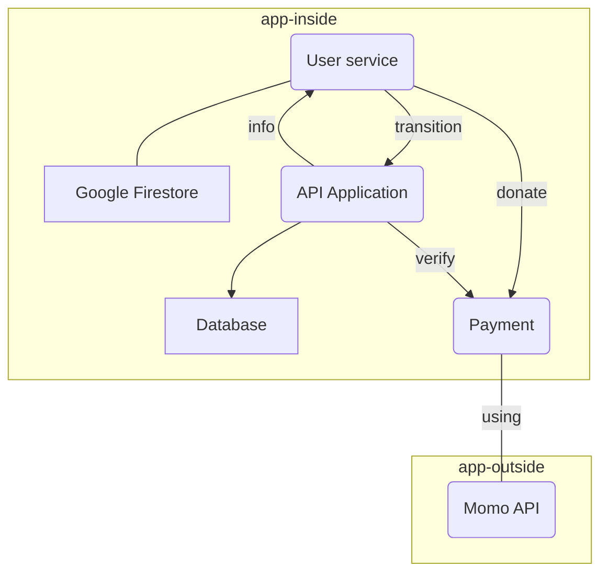

### Microservices Breakout

| Microservices | Descriptions | Tech stacks | Deployment environment|
|--|--|--|--|
|User Service|management portal for user|Next.js|Firebase + Google Cloud Function|
|API Application|payment and database|Python Flask|Google Cloud Run|
|Payment API|payment and database|Python|Google Cloud Function|
|Database| store transition data| PostgreSQL|Cloud SQL|
|Google Firestore| store user data and setting |Firebase|Firebase|
### Diagram

Communication of microservices: RESTful API

Microservices|Develop Environment | Test Environment | Production Environment
--|--|--|--
User-service | Localhost | Vercel | Firebase
Payment | Localhost | Python Env | Google Cloud Function
Balance | Localhost | Docker | Google Cloud Run
Database | Localhost | Google Cloud SQL | Google Cloud SQL

Microservices| IP address 
--|--
User-service | http://localhost:3000 
Payment | https://asia-northeast1-resolute-casing-403214.cloudfunctions.net/payment
Balance | http://127.0.0.1:5000 
Database | 34.101.207.186:5432 