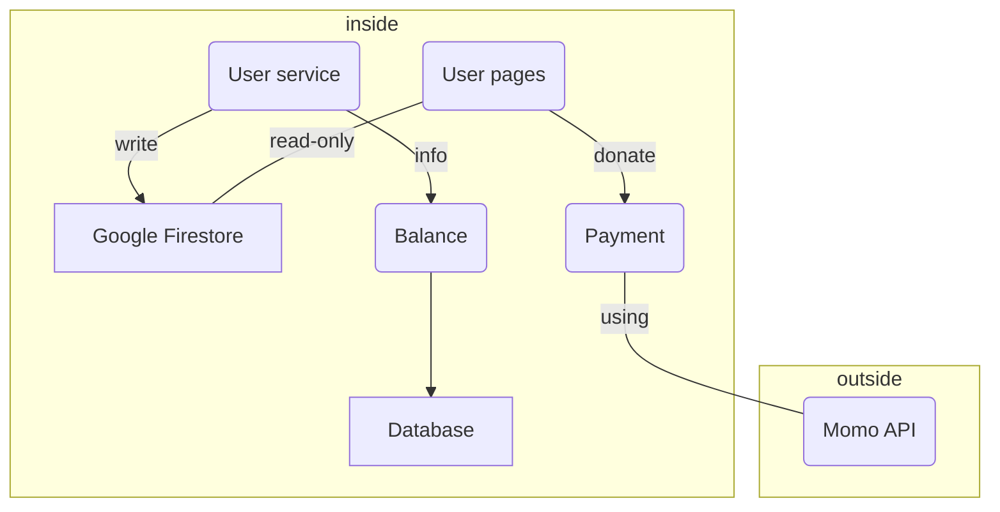

### Microservices Breakout

| Microservices | Descriptions | Tech stacks | Deployment environment|
|--|--|--|--|
|User Pages|icremental-site generator|Next.js|Firebase|
|User Service|management portal for user|Next.js|Google Cloud Run|
|Application API|payment and database|Python|Google Cloud Function|
|Database| store transition data| Postgres|Cloud SQL|
|Google Firestore| store user data and setting |GCP|GCP|
### Diagram

Communication of microservices: RESTful API

Develop Environment | Test Environment | Production Environment
--|--|--
Localhost | Docker | Google cloud platform
