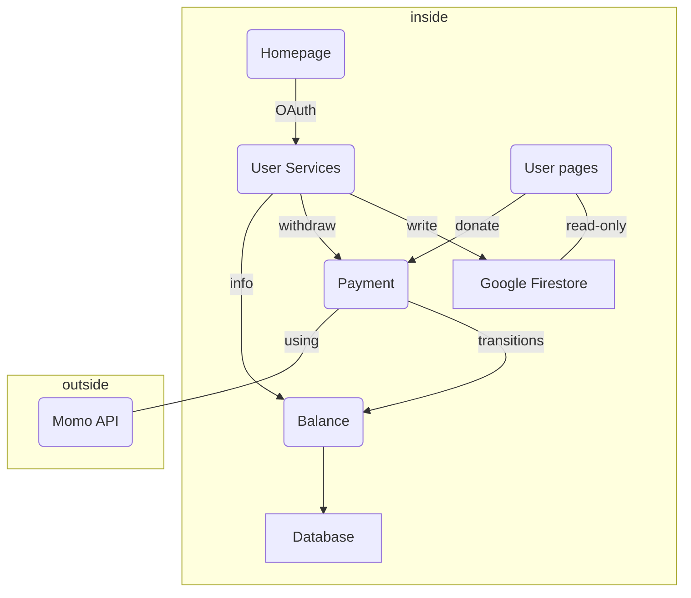

### Microservices Breakout
- Homepage - intro & login through OAuth
- User Landing pages (per user) - static-site generator
- User service (management portal for user)
- Payment (deposit & withdraw) - using Momo API
- Balance - manage transition (transition writer - ledger - history)
- Database - Postgres/MariaDB (store transitions data)
- Google Firestore (store user data)

| Microservices | Descriptions | Tech stacks |
|--|--|--|
|Homepage | overview & OAuth |Next.js|
|User Landing Pages|statics-site generator|Next.js|
|User service|management portal for user|Next.js|
|Payment|deposit & withdraw|Python|
|Balance| manage transition |Python|
|Database| store transition data| Postgres|
|Google Firestore| store user data and setting |GCP|

### Diagram

