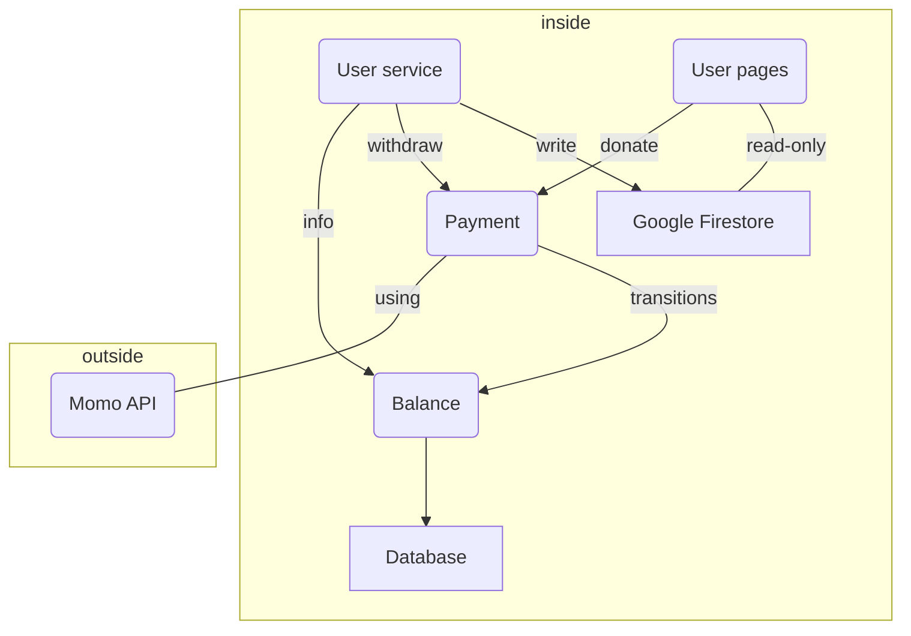

### Microservices Breakout
- %% Homepage  - intro & login through OAuth %%
- User Landing pages (per user) - static-site generator
- User service (management portal for user)
- Payment (deposit & withdraw) - using Momo API
- Balance - manage transition (transition writer - ledger - history)
- Database - Postgres/MariaDB (store transitions data)
- Google Firestore (store user data)

| Microservices | Descriptions | Tech stacks | Deployment environment|
|--|--|--|--|
|User Landing Pages|icremental-site generator|Next.js|Firebase|
|User service|management portal for user|Next.js|Google Cloud Run|
|Payment|deposit & withdraw|FastAPI (Python)|Google Cloud Run|
|Balance| manage transition |FastAPI (Python)|Cloud Run|
|Database| store transition data| Postgres|Cloud SQL|
|Google Firestore| store user data and setting |GCP|GCP|

### Diagram

